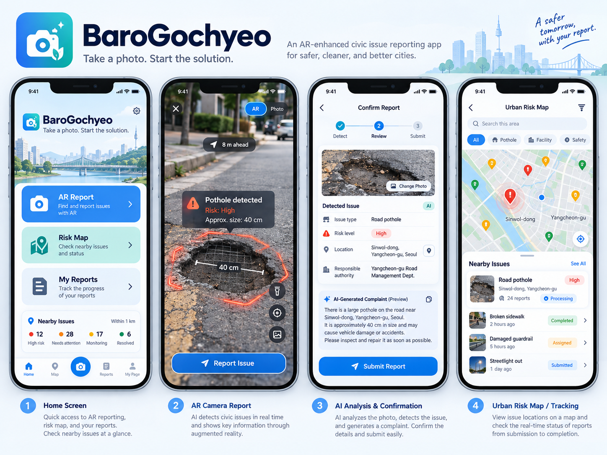
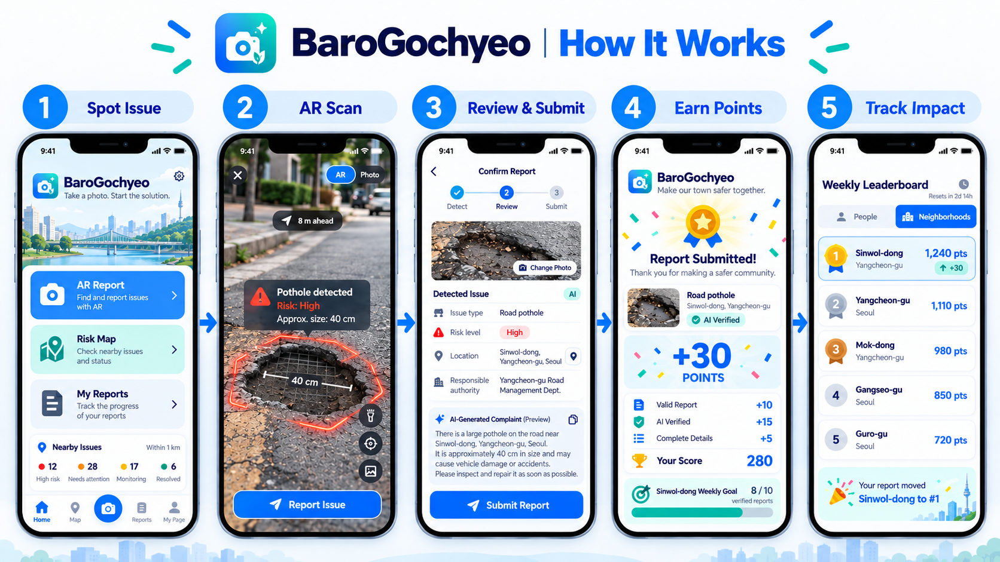
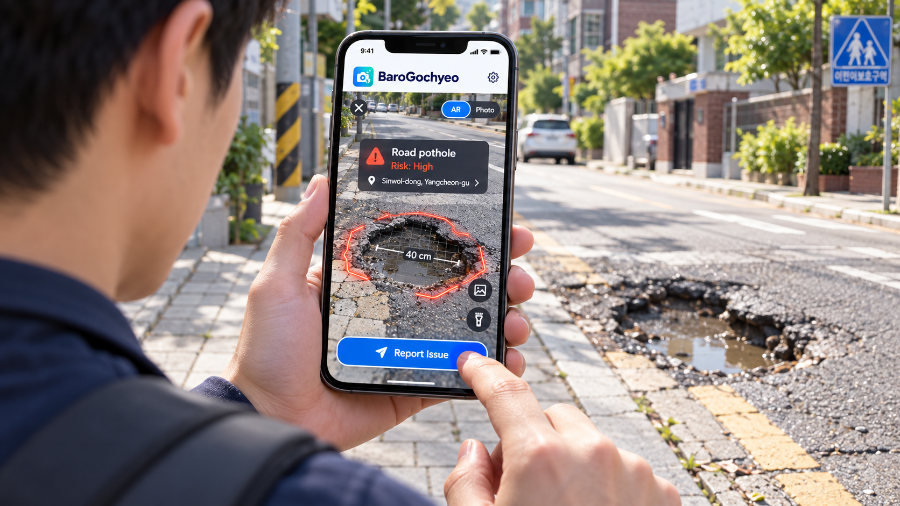
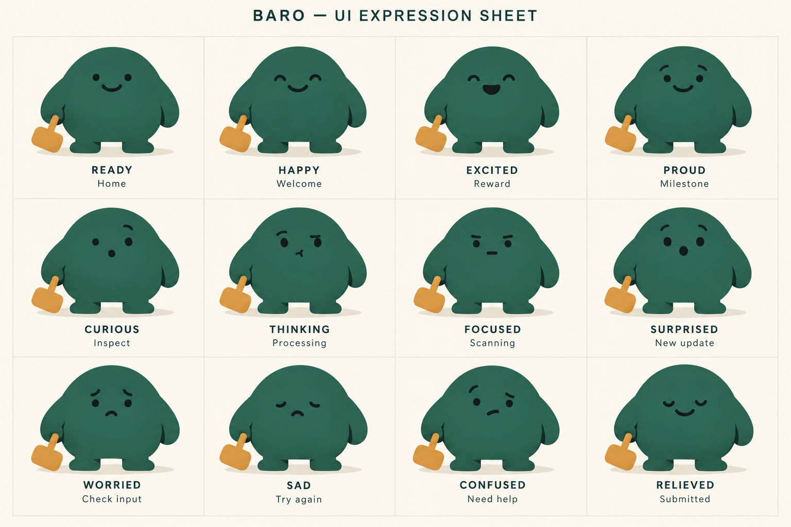
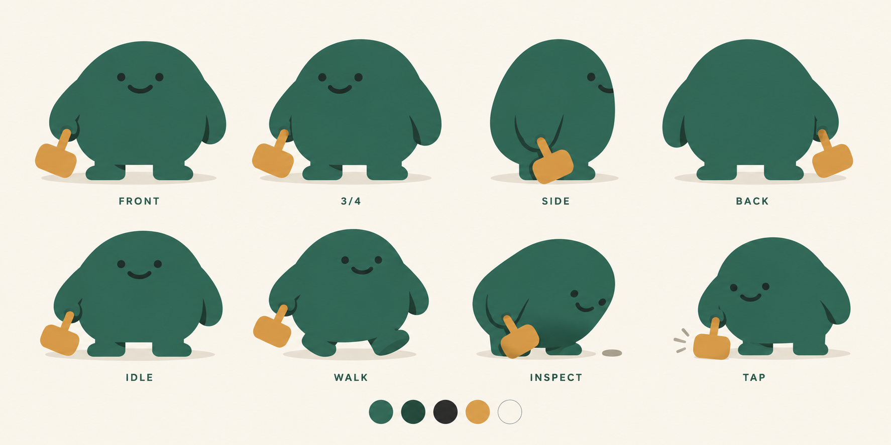

# 📸 바로고쳐 (BaroGochyeo)
> **Take a photo. Start the solution.**  
> 사진 한 장으로 시작되는 스마트 도시 안전 해결 솔루션 (AR Civic Reporting & Motion System)

[](https://kaiiidesu.github.io/BaroGochyeo/)
[](manifest.webmanifest)
[]()



---

## 🌐 Live Web Demo
체험 링크: **[https://kaiiidesu.github.io/BaroGochyeo/](https://kaiiidesu.github.io/BaroGochyeo/)**  
*(GitHub 저장소의 `Settings` → `Pages`에서 `main` 브랜치 배포 활성화 시 즉시 동작합니다.)*

---

## 📖 프로젝트 소개 (About Project)

**바로고쳐(BaroGochyeo)**는 도로 파손, 포트홀, 파손된 시설물 등 도시 위험 요소를 시민이 스마트폰 카메라로 비추기만 하면 실시간 AR로 자동 감지·측정하고, AI가 민원 공문서를 자동 작성하여 즉각 접수할 수 있도록 돕는 **시민 참여형 스마트 시티 웹 애플리케이션**입니다.

동별(공개) 경쟁과 개인(비공개) 진행 상황을 분리한 하이브리드 게이미피케이션으로, 중복·허위 신고를 부추기지 않으면서 참여를 돕습니다.

> **로컬 프로토타입**: 모든 데이터는 이 브라우저(Local Storage)에만 저장됩니다. 로그인은 시뮬레이션이며, 동네 점수 시작값과 AI 분석 결과는 샘플 데이터입니다.



---

## 🌟 주요 기능 (Key Features)

### 1. 🎯 실시간 AR 카메라 HUD (Live AR Detection HUD)
- **상단 모드 스위치**: `[ AR | Photo ]` 실시간 토글
- **위험물 스마트 타겟팅 박스**:
  - `Pothole detected` / `Risk: High` / `Approx. size: 40 cm` / `8 m ahead`
- **치수 가이드라인**: 도로 위 증강현실 측정 눈금 (`|← 40 cm →|`)
- **카메라 보조 도구**: 플래시라이트(Torch), 재스캔(Re-scan), 갤러리 업로드
- **원클릭 접수 버튼**: `✈️ Report Issue` 즉시 다음 단계 연결



### 2. 📋 AI 확인 및 검토 화면 (Confirm & Review)
- **3단계 프로그레스 바**: `1. Detect` → `2. Review` → `3. Submit`
- **현장 사진 교체 기능**: `📷 Change Photo`
- **민원문 자동 작성** (독립 실행 프로토타입에서는 샘플 AI 결과로 표시)
- **AI 생성 민원문**: 자동 생성된 행정 양식 문구 및 원클릭 복사 (`📋 Copy`)
- **위험도 및 관할 배정**: High / Medium / Low 변경 및 담당 부서(양천구 도로관리과) 자동 배정 안내
- **안전신문고 연동**: 정부 '안전신문고(Safety e-Report)' 바로가기 지원

### 3. 🎉 축하 및 보상 모먼트 (Celebration & Points)
- **색종이 폭죽 애니메이션**: 캔버스 파티클 기반의 화려한 Confetti 폭죽 효과
- **+30 포인트 획득 팝업**: 접수 보상(+10), AI 검증(+15), 상세 정보 입력(+5) 상세 내역 표시
- **주간 목표 게이지**: 신월1동 / 양천구 주간 목표 달성률 실시간 반영
- **웹 오디오 & 햅틱 반응**: Web Audio API 기반 신디사이저 사운드(셔터음, 탭 효과음, 축하 팡파레) 및 기기 진동 지원

### 4. 🏘️ 동네(Neighborhood) 탭 — 동별 주간 리더보드
- **동별 랭킹만 공개**: 개인 이름이 나오는 공개 랭킹은 없습니다.
- **포디움**: 1위(머스터드·중앙·가장 높음), 2위(블루), 3위(코랄) + 4위 이하 카드 리스트
- **우리 동네 카드**: 현재 순위, 점수, 월요일 이후 순위 변동
- **공유 주간 미션**: 적격 신고 `7 / 10`, 남은 시간, 미션 상세 화면
- **커뮤니티 임팩트**: 우리 동네의 수리 완료 / 처리 중 / 대기 건수
- **샘플 데이터 표기**: 동네 점수의 시작값은 "Sample neighborhood data"로 표시되는 결정적(deterministic) 주간 샘플이며, 이 기기의 신고가 그 위에 더해집니다.

### 4-1. 👤 나(Me) 탭 — 비공개 개인 진행 상황
- **데모 계정**: 스플래시 → 환영 화면 → 로그인 / 계정 만들기 / 게스트로 계속 (로컬 데모, 비밀번호 없음, 서버 없음)
- **점수 구분**: 사용 가능 포인트 · 총 기여 · 이번 주 · 동네 점수 · 미션 진행도를 서로 다른 값으로 표시 (ⓘ 설명 시트)
- **개인 주간 미션 3개**: 상세 신고 1건 / 상태 변경 확인 / 동네 미션 기여 — 주 1회 한도, 포인트 없음
- **배지 5종**, 내 신고, 리워드, 효과음 설정

### 5. 🛠️ 별도 모듈 및 PWA 지원
- **AR 거리/치수 측정기 (`ar-measure.html`)**: WebXR 및 인터랙티브 탭 기반 2점 거리 실측 도구
- **PWA 웹 앱 매니페스트 (`manifest.webmanifest`)**: 홈 화면 추가 및 네이티브 앱과 동일한 전체화면 경험 제공

---

## 🎨 캐릭터 마스코트 (BARO - Mascot)

친근한 도시 안전 지킴이 마스코트 **'바로(BARO)'**의 표정 및 포즈 시트:

| 표정 시트 (Expression Sheet) | 포즈 시트 (Poses Sheet) |
|:---:|:---:|
|  |  |

---

### 마스코트 에셋 백로그 (Mascot asset backlog)
앱은 `index.html`에 포함된 깨끗한 포즈 6종(front, three, idle, walk, inspect, tap)만 사용합니다. 라벨이 있는 시트(`docs/mascot-expressions.png`)는 잘라 쓰지 않습니다. 디자인팀이 투명 배경 단독 파일로 내보내야 할 항목:

- 표정: Happy, Excited, Proud, Thinking, Focused, Surprised, Worried, Sad, Confused, Relieved
- 포즈: **Proud** (배지 획득 · 미션 완료), **Working** (미션 상세 · 진행 중)

---

## 📁 프로젝트 파일 구조 (Project Structure)

```text
BaroGochyeo/
├── index.html              # 메인 앱: 화면 마크업, 디자인 토큰, 신고·지도·리워드 핵심 로직, 로컬 데이터 런타임
├── progress.js             # 점수 · 미션 · 배지 · 리더보드 계산 (순수 함수, UI 없음)
├── auth-mock.js            # 데모 인증 어댑터 (로컬 전용, 실제 백엔드로 교체할 파일)
├── game-juice.js           # 모션, 카메라 상태, 성공 화면, 동네 탭, 주간 미션
├── shell.js                # 스플래시, 환영/로그인/가입, 나(Me) 탭, 개인 미션, 배지, 점수 설명
├── motion.css              # 모션 디자인 시스템, 인터랙션 상태
├── shell.css               # 내비게이션, 카메라 HUD, 동네, 성공, 프로필, 게이트 스타일
├── ar-measure.html         # WebXR AR 치수 측정 독립 페이지
├── motion.js               # (미사용) 이전 버전 스크립트 — index.html에서 로드하지 않음
├── manifest.webmanifest    # PWA 설정 매니페스트
├── icons/                  # PWA 앱 아이콘
├── docs/                   # 포스터 및 마스코트 디자인 자료
├── reports/screenshots/    # UI 스크린샷 (v2/ = 현재 버전)
└── README.md
```

---

## 🚀 실행 방법 (Getting Started)

### 1. 로컬에서 실행 (Local Preview)
별도의 빌드 과정(Node.js/npm) 없이 브라우저에서 바로 열 수 있는 순수 웹 표준(Vanilla Web) 파일입니다.

- **방법 A**: `index.html` 파일을 더블 클릭하여 웹 브라우저에서 엽니다.
- **방법 B (카메라/AR 권한 테스트 권장 - 로컬 서버)**:
  ```bash
  # Python이 설치되어 있는 경우:
  python -m http.server 8000
  # 또는 npx serve:
  npx serve .
  ```
  브라우저에서 `http://localhost:8000` 접속

### 2. GitHub Pages 배포 방법 (Web Hosting)
1. GitHub 저장소(`https://github.com/KAIIIdesu/BaroGochyeo`) 접속
2. 상단 메뉴 **Settings** 클릭
3. 좌측 사이드바 **Pages** 클릭
4. **Build and deployment** > **Branch**에서 `main` 브랜치 선택 및 `/(root)` 선택 후 **Save** 클릭
5. 약 1분 후 생성되는 배포 주소(`https://kaiiidesu.github.io/BaroGochyeo/`)로 누구나 바로 접속 가능합니다.

---

## 🛠️ 기술 스택 (Tech Stack)

- **Frontend**: HTML5, Vanilla JavaScript (ES6+), Modern CSS3 (CSS Variables, Flexbox, Grid, 3D Transforms)
- **Web Audio API**: 브라우저 내장 오디오 합성 엔진 (무거운 mp3 파일 다운로드 없이 실시간 사운드 재생)
- **Animation & FX**: HTML5 Canvas Particle Engine (Confetti), Haptic Vibration API
- **AR & Sensors**: WebXR API / Camera MediaStream API (Live Video Feed)
- **PWA**: Web App Manifest, Standalone Display Mode, Responsive Viewport Optimization
